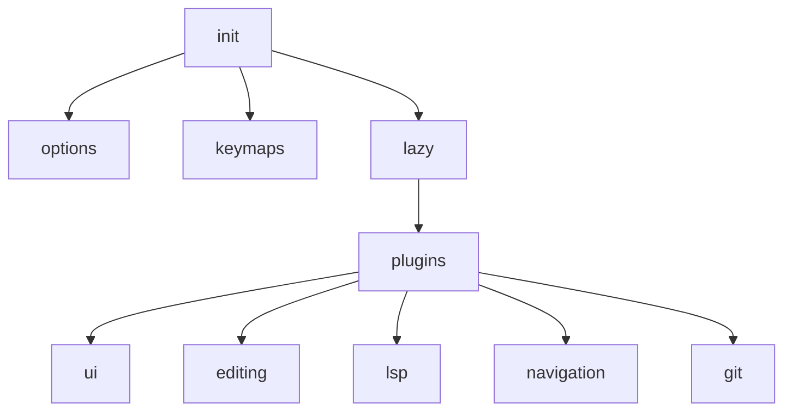

# 项目概览
这是一套使用 Lua 编写的轻量级 Neovim 配置，通过 **lazy.nvim** 管理插件，涵盖 LSP、自动补全、代码格式化以及界面优化。

# 快速开始
```bash
# 克隆到 Neovim 配置目录
git clone <repo> ~/.config/nvim
# 运行 Neovim，插件会自动安装
nvim
# 日后同步/更新插件
:Lazy sync
```
Lua 语法检查：
```bash
find lua -name '*.lua' -print0 | xargs -0 luac -p
```

## 终端快捷键
- `<leader>t1` 切换终端 1
- `<leader>t2` 切换终端 2
- `<leader>tf` 打开浮动终端
- 在终端模式下按 `<Esc>` 返回普通模式，输入 `exit` 或 `:q` 关闭终端

# 目录结构与关键文件
```bash
$ tree -L 2
. 
├── CHANGELOG.md
├── PROJECT_GUIDE.md
├── README.md
├── init.lua
├── lazy-lock.json
└── lua
    ├── core
    └── plugins
```
- **init.lua** – 载入选项与按键，并安装 lazy.nvim
- **lazy-lock.json** – 锁定插件版本
- **lua/core** – 选项、按键映射及 Python 辅助函数
- **lua/plugins** – 按功能分类的插件配置

# 架构与数据流

Neovim 首先执行 `init.lua`，设置全局选项与按键，然后通过 lazy.nvim 加载各插件模块，每个模块负责对应功能的配置。

# 代码风格与约定
- 语言：Lua 5.4
- 插件管理：lazy.nvim
- 暂无明确的分支或提交信息规范
- 代码格式化依赖 `stylua`（由 conform.nvim 调用）

# 测试与质量保证
- 使用 `luac -p` 进行 Lua 语法检查
- 目前没有自动化 CI

# 运行环境与部署
- 需要安装 Neovim 与 C 编译器（用于 tree-sitter）
- 推荐字体：JetBrainsMono Nerd Font
- LSP 服务器通过 `mason` 和 `mason-lspconfig` 安装
- `core/python.lua` 支持虚拟环境 Python

# 已知问题 / TODO
源文件中未发现 TODO 或 FIXME 标记。

# 功能索引
- **主题与透明度** – `lua/plugins/ui/cyberdream.lua`, `lua/plugins/ui/transparent.lua`
- **状态栏** – `lua/plugins/ui/lualine.lua`
- **文件树** – `lua/plugins/ui/nvim_tree.lua`
- **快捷键提示** – `lua/plugins/ui/which_key.lua`
- **图标支持** – `lua/plugins/ui/mini.lua`
- **终端切换** – `lua/plugins/editing/toggleterm.lua`
- **Treesitter 高亮** – `lua/plugins/editing/nvim_treesitter.lua`
- **行/块移动** – `lua/plugins/editing/nvim_gomove.lua`
- **彩虹括号** – `lua/plugins/editing/rainbow_delimiters.lua`
- **代码格式化** – `lua/plugins/editing/conform.lua`
- **窗口分割管理** – `lua/plugins/navigation/smart_splits.lua`
- **模糊查找** – `lua/plugins/navigation/telescope.lua`
- **Git 集成** – `lua/plugins/git/gitsigns.lua`
- **自动补全** – `lua/plugins/lsp/nvim_cmp.lua`
- **LSP 配置** – `lua/plugins/lsp/nvim_lspconfig.lua`
- **Mason 集成** – `lua/plugins/lsp/mason.lua`, `lua/plugins/lsp/mason_lspconfig.lua`
- **Python 虚拟环境辅助** – `lua/core/python.lua`, `lua/plugins/lsp/uv.lua`

# 参考链接
- [Nerd Fonts](https://www.nerdfonts.com/font-downloads)
- [LLVM Releases](https://github.com/llvm/llvm-project/releases)
